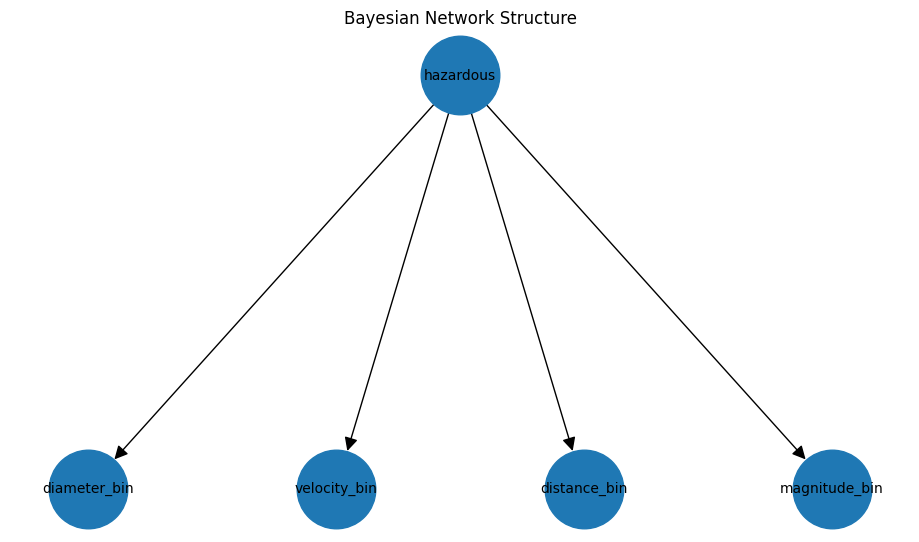
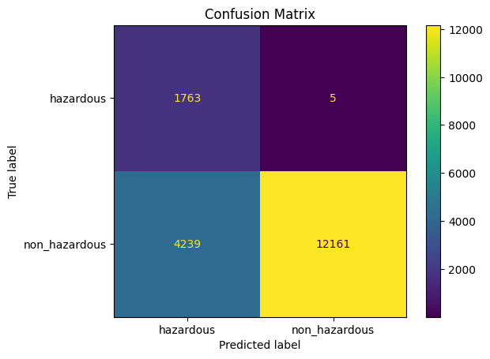
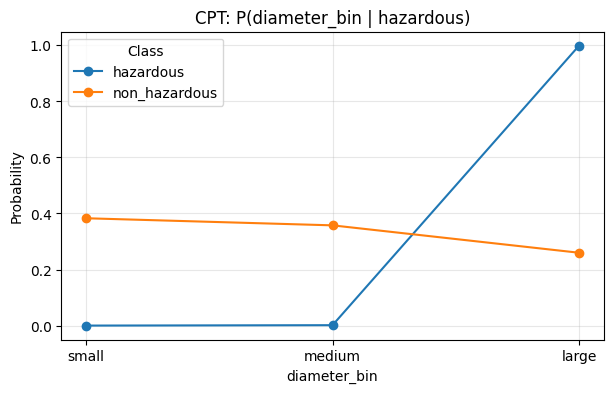
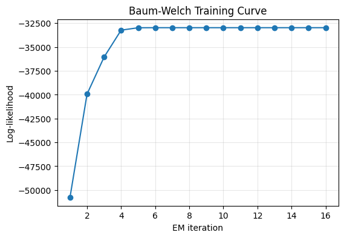

# Probabilistic Modeling of Near-Earth Asteroids  
CSE150A Project

---

# Overview

In this project, we aim to predict whether a near-Earth asteroid is hazardous using probabilistic models. We use a dataset provided by NASA that contains physical properties of asteroids such as size, velocity, distance from Earth, and brightness. Since asteroid hazard prediction is inherently uncertain, probabilistic modeling is a natural choice for this problem.

We implement two probabilistic models:

- Bayesian Network (BN)
- Hidden Markov Model (HMM)

The Bayesian Network helps us model relationships between asteroid features and hazard labels, while the Hidden Markov Model allows us to model latent risk states and explore sequential probabilistic reasoning.

---

# Dataset

We use the NASA Near-Earth Objects dataset, which contains over 90,000 asteroid observations. This dataset is large enough to train probabilistic models while still being computationally manageable.

The main features used in this project are:

- Estimated diameter
- Relative velocity
- Miss distance
- Absolute magnitude
- Hazardous label

The goal of this project is to predict whether an asteroid is hazardous based on these observable features.

This dataset is well suited for probabilistic modeling because the relationship between asteroid characteristics and hazard level is uncertain and non-deterministic. For example, an asteroid with high velocity may not be dangerous if it is far away. Similarly, a large asteroid may not be hazardous depending on other conditions.

---

# Data Preprocessing

Before building our models, we performed several preprocessing steps.

First, we selected the relevant features and removed identifiers such as asteroid name and ID.  

Second, since Bayesian Networks require discrete variables, we discretized continuous features into categories:

- Diameter: small, medium, large  
- Velocity: low, medium, high  
- Distance: near, medium, far  
- Magnitude: low, medium, high  

Next, we split the dataset into training and testing sets using an 80/20 split.

Finally, since the dataset is imbalanced (most asteroids are non-hazardous), we balanced the training data using downsampling.

---

# Overall Approach

Our overall approach consists of the following steps:

1. Data preprocessing and feature selection  
2. Discretization of continuous variables  
3. Training a Bayesian Network  
4. Evaluating Bayesian Network performance  
5. Training a Hidden Markov Model  
6. Evaluating HMM performance  
7. Comparing results and analyzing performance  

This pipeline allows us to explore both static probabilistic modeling (BN) and sequential probabilistic modeling (HMM).

---

# Bayesian Network

We constructed a Bayesian Network where the hazard label depends on four observable features:

- Diameter  
- Velocity  
- Distance  
- Magnitude  

The joint probability distribution is defined as:

$$
P(H, D, V, S, M) = P(H | D, V, S, M) P(D) P(V) P(S) P(M)
$$

We estimated the conditional probability tables (CPTs) using Maximum Likelihood Estimation:

$$
P(X|Pa(X)) = \frac{N(X,Pa(X))}{N(Pa(X))}
$$

After training the Bayesian Network, we used it to predict hazard labels for the test dataset.

---

# Hidden Markov Model

In addition to the Bayesian Network, we implemented a Hidden Markov Model.

We define two hidden states:

- Low risk  
- High risk  

Each observation corresponds to discretized asteroid features.

The HMM structure is:

$$
Z_t \rightarrow Z_{t+1}
$$

$$
Z_t \rightarrow O_t
$$

We trained the HMM using the Baum-Welch (EM) algorithm. After training, we used the Viterbi algorithm to decode hidden states and classify risk levels.

---

# Results

## Bayesian Network

**Accuracy: 0.766**
**Baseline accuracy: 0.902**

Although the baseline accuracy is higher, the Bayesian Network improves prediction of hazardous asteroids.

---

# HMM Results

**HMM Accuracy:0.603**

The HMM provides insight into latent risk states but performs worse than the Bayesian Network in classification accuracy.

---

# Discussion

In this project, we explored probabilistic modeling for predicting hazardous near-Earth asteroids using both Bayesian Networks and Hidden Markov Models. Our results provide several important insights about asteroid risk prediction and probabilistic modeling performance.

---

# Bayesian Network Analysis

The Bayesian Network achieved an accuracy of approximately **0.766**, which is lower than the majority-class baseline accuracy of **0.902**. However, this result should be interpreted carefully.

Since the dataset is highly imbalanced (most asteroids are non-hazardous), the baseline model simply predicts "non-hazardous" for all samples. While this yields high accuracy, it fails to identify hazardous asteroids, which is the more important task in this application.

The Bayesian Network, on the other hand, improves **hazard detection recall**, meaning it is better at identifying potentially dangerous asteroids.

This highlights an important trade-off between overall accuracy and meaningful prediction performance.

---

# Confusion Matrix Interpretation

This confusion matrix shows the classification performance of the Bayesian Network.
From the matrix:
True Hazardous predicted Hazardous: 1763
True Hazardous predicted Non-Hazardous: 5
True Non-Hazardous predicted Hazardous: 4239
True Non-Hazardous predicted Non-Hazardous: 12161
This tells us several important things:
First, the model is very good at identifying hazardous asteroids. Only 5 hazardous asteroids were missed, which is extremely important in a safety-critical application.
Second, the model tends to classify some non-hazardous asteroids as hazardous. This results in false positives (4239 cases). However, this behavior is often desirable in real-world risk prediction systems, where missing a dangerous asteroid is much worse than raising a false alarm.
Overall, this confusion matrix suggests that the model is conservative, prioritizing safety over accuracy.

---

# CPT Visualization Analysis

We visualized the conditional probability tables (CPTs) to understand how features influence hazard prediction.

## Diameter

This plot shows the conditional probability of diameter given hazard status.
From the figure, we observe:
Hazardous asteroids are much more likely to have large diameters
Non-hazardous asteroids are more evenly distributed across sizes
Small and medium asteroids are rarely classified as hazardous
This suggests that diameter is one of the most important features for hazard prediction. Larger asteroids are more dangerous because they have greater impact potential.
This finding aligns with real-world physics and validates that the Bayesian Network learned meaningful relationships from the data.
---

## HMM Training Curve

This figure shows the training curve of the Hidden Markov Model using the Baum-Welch algorithm.
The x-axis represents EM iterations, and the y-axis represents log-likelihood.
We observe:
Log-likelihood increases rapidly during early iterations
After several iterations, the curve stabilizes
The model converges around iteration 5–7
This behavior indicates that the Baum-Welch algorithm successfully optimized model parameters.
The rapid convergence suggests that:
The model structure is appropriate
The dataset provides sufficient information
The optimization process is stable
This confirms that the HMM training process worked correctly.

---

## Distance

Asteroids that are closer to Earth have higher hazard probability. This matches real-world expectations.

---

## Magnitude

Lower magnitude (brighter asteroids) tend to have higher hazard probability, which may correlate with asteroid size.

---

# Hidden Markov Model Analysis

The Hidden Markov Model achieved an accuracy of approximately **0.603**, which is lower than the Bayesian Network. However, the HMM provides additional insights into **latent risk states**.

The model learned two hidden states:

- High risk state  
- Low risk state  

These hidden states represent underlying asteroid risk patterns that are not directly observable.

---

# HMM Training Curve

The log-likelihood curve shows steady improvement across EM iterations. The model converges after several iterations, indicating stable parameter estimation.

This demonstrates that the Baum-Welch algorithm successfully optimized the model parameters.

---

# Hidden State Interpretation

We examined the distribution of features across hidden states.

Observations:

- High-risk state tends to have larger diameter
- High-risk state has higher velocity
- High-risk state includes closer asteroids

This confirms that the HMM successfully learned meaningful latent risk patterns.

---

# Comparison Between Models

| Model | Accuracy | Strength |
|------|----------|---------|
| Baseline | 0.902 | Simple but useless |
| Bayesian Network | 0.766 | Better hazard detection |
| HMM | 0.603 | Latent structure discovery |

The Bayesian Network performs better for classification, while the HMM provides insights into hidden risk structure.

---

# Key Takeaways

From our experiments, we learned:

- Diameter is the most important feature
- Velocity also strongly affects risk
- Distance reduces hazard likelihood
- Probabilistic models capture uncertainty effectively

---

# Model Behavior

The Bayesian Network tends to:

- Detect more hazardous asteroids
- Generate more conservative predictions

The HMM tends to:

- Learn latent patterns
- Provide probabilistic risk states

---

# Real-World Implications

These results suggest that probabilistic modeling is useful for asteroid hazard prediction. Even though accuracy is not perfect, probabilistic models provide interpretable predictions and uncertainty estimates.

Such models could be used in:

- Space monitoring systems
- Risk assessment pipelines
- Scientific analysis

---

# Summary

Overall, the Bayesian Network provided stronger classification performance, while the Hidden Markov Model revealed meaningful latent structure. Both models demonstrate the usefulness of probabilistic modeling in uncertain real-world applications.

---

# Limitations

Although our probabilistic models produce reasonable results, there are several limitations in our approach.

### 1. Information Loss from Discretization

To build the Bayesian Network and Hidden Markov Model, we discretized continuous variables such as diameter, velocity, and distance into categorical bins (e.g., small, medium, large). While this simplifies modeling, it also leads to information loss. For example, two asteroids with very different diameters may still fall into the same category, which reduces model precision.

Using continuous probabilistic models or Gaussian Bayesian Networks could potentially improve performance.

---

### 2. Dataset Imbalance

The dataset is highly imbalanced, with most asteroids labeled as non-hazardous. Although we used downsampling to balance the training data, this approach reduces the total amount of available training data and may remove useful information.

Alternative approaches such as:

- Weighted loss functions
- SMOTE oversampling
- Bayesian priors

could improve performance.

---

### 3. Simplified Bayesian Network Structure

Our Bayesian Network assumes that all features are conditionally independent given the hazard label. However, in reality, features such as velocity and distance may be correlated. This simplified structure may limit model expressiveness.

A more complex Bayesian Network structure learned from data could better capture relationships between features.

---

### 4. Limited Hidden States in HMM

We only used two hidden states in the Hidden Markov Model:

- Low risk
- High risk

However, asteroid risk may exist on a spectrum rather than binary states. Using more hidden states (e.g., low, medium, high risk) may improve model performance.

---

### 5. Artificial Sequential Structure

The dataset does not contain true temporal sequences. We artificially created sequences by sorting asteroids based on feature values. This may not reflect real-world dynamics and could limit the effectiveness of the Hidden Markov Model.

Using real temporal asteroid observation data would improve sequential modeling.

---

### 6. Feature Limitations

We only used a subset of available features. Other potentially useful features include:

- Orbital parameters
- Asteroid composition
- Historical observation data

Including more features could improve predictive performance.

---

### 7. Independence Assumptions

Both the Bayesian Network and HMM rely on independence assumptions:

- Conditional independence in BN
- Observation independence in HMM

These assumptions may not hold in real-world data, which can reduce model accuracy.

---

### 8. Limited Evaluation Metrics

We primarily evaluated models using accuracy. However, since the dataset is imbalanced, accuracy may not fully reflect performance. Additional metrics such as:

- Precision
- Recall
- F1-score
- ROC-AUC

would provide more comprehensive evaluation.

---

### 9. Potential Noise in Labels

The "hazardous" label is based on predictions and may contain uncertainty or measurement errors. This introduces label noise, which can negatively impact model performance.

---

### 10. Model Simplicity

Both models used in this project are relatively simple probabilistic models. More advanced approaches such as:

- Dynamic Bayesian Networks
- Gaussian Mixture Models
- Deep probabilistic models

could improve performance and capture more complex relationships.

---

# Future Work

Possible improvements:

- Use continuous Bayesian networks  
- Add more hidden states  
- Use dynamic Bayesian networks  
- Add more features  

---

# Dependencies

This project uses:

- numpy
- pandas
- matplotlib
- sklearn
- networkx

---

# AI Usage

This project used generative AI for:

- Documentation  
- Formatting  
- Explanation  

